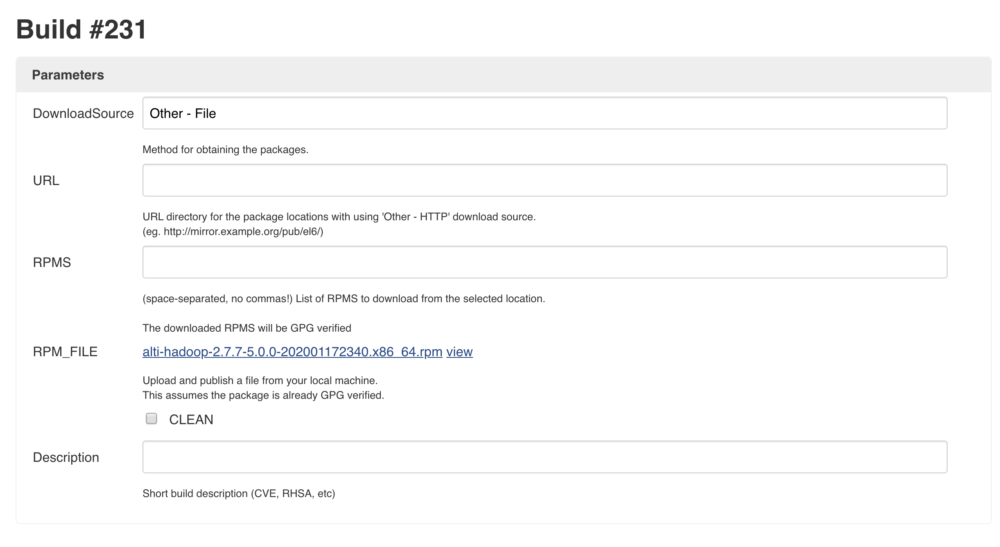

# Validating RPM via pipeline [(BDSBLUE-604)](https://sapjira.wdf.sap.corp/browse/BDSBLUE-604)

Once the RPM has been generated and published to nexus via the xmake pipeline, the RPM needs to be validated by running the workbench tests. See [workbench_tests](https://github.com/VertiCloud/workbench_tests) for more info on how to run the workbench tests on your desktop machine.

## Uploading RPM to Verticloud test repository

Instead of manually removing the existing verticloud-prod RPM on your desktop and installing the xmake RPM, the recommended approach of testing would be to deploy the RPM to a verticloud repository and install it via the pipeline. We will be uploading the RPM to the verticloud-test repository and install it by enabling the test repository [by default it is disabled].

1. Manually download the RPM from nexus repository to your local machine
2. On jenkins-dev, open the yum-test-repo-upload job:  https://jenkins-dev.service.altiscale.com/job/yum-test-repo-upload/
3. Click on **Build With Parameters**. Select *Other-File* as the DownloadSource parameter and attach the RPM from your local machine by clicking on *Choose File* under RPM_FILE parameter
4. Click on **Build**
5. After the *yum-test-repo-upload* and its downstream job has successfully run, verify whether the RPM was published to yum-test-repo by issuing the following command:
    yum --enablerepo=verticloud-test list | grep <service>

    example: yum --enablerepo=verticloud-test list | grep hadoop-2.7.7
    name: alti-hadoop-2.7.7.x86_64        |  version-release: 5.0.0-202001172340    |  verticloud-test

NOTE: Make sure the **version** and **release** format of the RPM aligns with the already installed RPM in the cluster for your services.

## Overriding the environment cookbook of your cluster
After the *yum-test-repo-upload* and its downstream job has successfully run, we need to override the environment cookbook of the respective cluster to
1. **enable the yum test repo**

    Include the following line in your default.rb attributes file [env_cookbook/attributes/default.rb]
    override['altiscale']['yum_repo']['test']['enabled'] = true

    An example of anil1007 cluster: https://github.com/VertiCloud/alti_anil1007_cluster_env-cookbook/blob/master/attributes/default.rb#L107

2. **point to the xmake version of RPM deployed in test repo**

    In order to point to the xmake version of the RPM deployed in test repo, check the respective service's cookbook under attributes folder to find current version of the RPM used.

    An example of hadoop RPM:
    https://github.com/VertiCloud/alti_hadoop_app-cookbook/blob/master/attributes/core.rb#L6

    Based on the above attribute for hadoop, following is used in the environment cookbook of anil1007 to override the version:
    https://github.com/VertiCloud/alti_anil1007_cluster_env-cookbook/blob/master/attributes/default.rb#L110

## Run the env-cookbook-update job
In order to bump the version of the environment cookbook and update the versions of the dependent cookbooks, run the following:
1. On jenkins-dev, open https://jenkins-dev.service.altiscale.com/job/hadoop_300_alti_stag_cluster_env-cookbook-update/
2. Click on **Build With Parameters**. mention your cluster name in the *CLUSTER* parameter and click on **BUILD**

    An example of anil1007 cluster: https://jenkins-dev.service.altiscale.com/job/hadoop_300_alti_stag_cluster_env-cookbook-update/2434/parameters/

## Run the deploy_and_test_cluster job
In order to deploy the changes to your cluster and test, either
1. run a cl_maintenance on your cluster [recommended] or
2.
    a. On jenkins-dev open https://jenkins-dev.service.altiscale.com/job/sarah_deploy_and_test/
b. Click on **Build With Parameters**. enter your cluster name [e.g. anil1007] in *CLUSTER_NAME* parameter.
c. enter the appropriate options from below in *OPERATIONS_TO_PERFORM* parameter: STOP_DESKTOP,STOP_CLUSTER,DEPLOY_CLUSTER,START_CLUSTER,CHECK_CLUSTER,DEPLOY_DESKTOP,START_DESKTOP,CHECK_DESKTOP,TEST_CLUSTER,TEST_DESKTOP
d. enter the appropriate DP_RELEASE in *HAIRBALL_RELEASE_BRANCH* parameter. We can verify this version in CHEF_RELEASE parameter of our create_pipeline_cluster job [https://jenkins-dev.service.altiscale.com/job/create_pipeline_cluster/]. The latest release is DP_RELEASE_20190327 which should be the value in most cases unless you changed the RELEASE specifically when creating a cluster.

